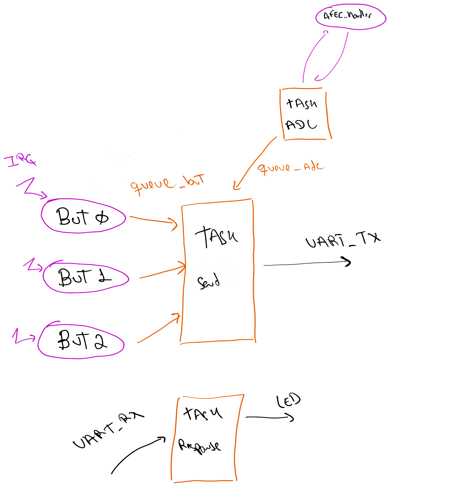

# 20b - AV2

Começando:

1. Atualize o arquivo `ALUNO.json` com seu nome e e-mail e faça um commit imediatamente.

**Faça o seu trabalho de maneira ética! Você não deve trocar informações com os seus colegas!**

- **A cada 30 minutos você deverá fazer um commit no seu código!**
    - Códigos que não tiverem commit a cada 30min ou que mudarem drasticamente entre os commits serão descartados (conceito I) !!
    - Você deve inserir mensagens condizentes nos commits!
- Duração: 3h
- **Usar como base o projeto RTOS-LED**

:triangular_flag_on_post: **Ao finalizar a entrega preencher o formulário (uma única vez!):**

## Descrição

Vocês irão portar o projeto 1, que foi realizado em baremetal, para usar o freertos. O projeto deve ter as mesmas funcionalidades da entrega:

- Enviar pela uart alteração em algum dos três botões (usando o protocolo)
- Enviar pela uart periodicamente o valor do ADC/volume (usando o protocolo)
- Receber o ack da comunicação ativa e indicar em um dos LEDs

Para isso vocês deverão criar 3 tarefas, 5 filas e 1 semáforo, conforme descrito e ilustrado a seguir:

- `queue_but0`, `queue_but1`, `queue_but2`: Fila para enviar alterações nos botões. 

- `queue_adc`: Fila para enviar os valores do ADC/Volume

- `semaphore_adc`: Semáforo para controle da aquisição de dados ADC

- `task_send`: Tarefa responsável por ler as filas `queue_but` e `queue_adc` e fazer o envio dos dados para uart

- `task_adc`: Tarefa que faz a leitura periodicamente do ADC e envia os dados pela fila `queue_adc`

- `task_response`: Tarefa que faz a leitura da UART e indica se a comunicação está ativa ou não.

## Rubrica

Vocês devem gravar um vídeo do firmware funcionando na placa para submeter o projeto.

:triangular_flag_on_post: **Ao finalizar a entrega preencher o formulário (uma única vez!):**

### C

> Validar pela uart, não usar bluetooth

Mesma funcionalidade da entrega 1 implementando em cima do freertos, com a estrutura sugerida anteriormente.

- Não devem mais usar o TC para aquisição de dados da uart/ adc.

### C+

- Fazer o envio direto do callback do adc para a task_send pela fila `queue_adc`.

!()[c+.png]

### B 

- Usar uma única fila para enviar os dados de todos os botões.

A informação a ser transmitida é composta de uma struct com: ID do botão (indica qual botão) e o status (aperado/liberado)

!()[b.png]

### A

Comunicar `task_response` com `task_send` indicando que a comunicação está estável, em caso de negativo e se o usuário 

..... salvar na fila para quando a comunicação estabilizar mandar os dados...
